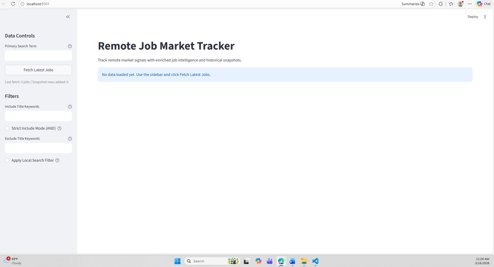

# Job Dashboard / Remote Job Market Tracker

A beginner-friendly Streamlit app that pulls live remote job listings, enriches them with useful metadata, and tracks snapshots over time so you can monitor market trends.

## What This App Does

- Fetches remote jobs from the Remotive API
- Cleans and enriches job records with fields like seniority, role family, remote scope, and detected skills
- Lets you filter jobs in the dashboard with sidebar controls
- Shows summary metrics and charts
- Stores snapshots in CSV format for simple trend tracking over time

## Tech Stack

- Python 3.10+
- Streamlit
- Requests
- Pandas
- Matplotlib
- Pytest (for tests)

## Project Structure

Main files and folders:

- job_dashboard_app.py: Streamlit entrypoint
- src/job_dashboard/: app modules (API, processing, filters, charts, storage, UI)
- tests/: unit tests
- data/: local runtime snapshot CSV
- images/: main app screenshot for README
- assets/screenshots/: extra chart screenshots
- archive/sandbox/: old experiments and learning scripts

## Quick Start

1. Clone the repo and move into the project folder.
2. Create and activate a virtual environment.
3. Install dependencies from requirements.txt.
4. Run the Streamlit app.

Windows PowerShell:

    python -m venv .venv
    .\.venv\Scripts\Activate.ps1
    pip install -r requirements.txt
    streamlit run job_dashboard_app.py

macOS/Linux:

    python3 -m venv .venv
    source .venv/bin/activate
    pip install -r requirements.txt
    streamlit run job_dashboard_app.py

Then open the local URL shown in the terminal (usually http://localhost:8501).

## Running Tests

Run:

    pytest -q

## Notes About Data

- Snapshot history is stored in data/job_snapshots.csv.
- That file is gitignored, so each local environment can build its own history.

## Screenshot Guidance

